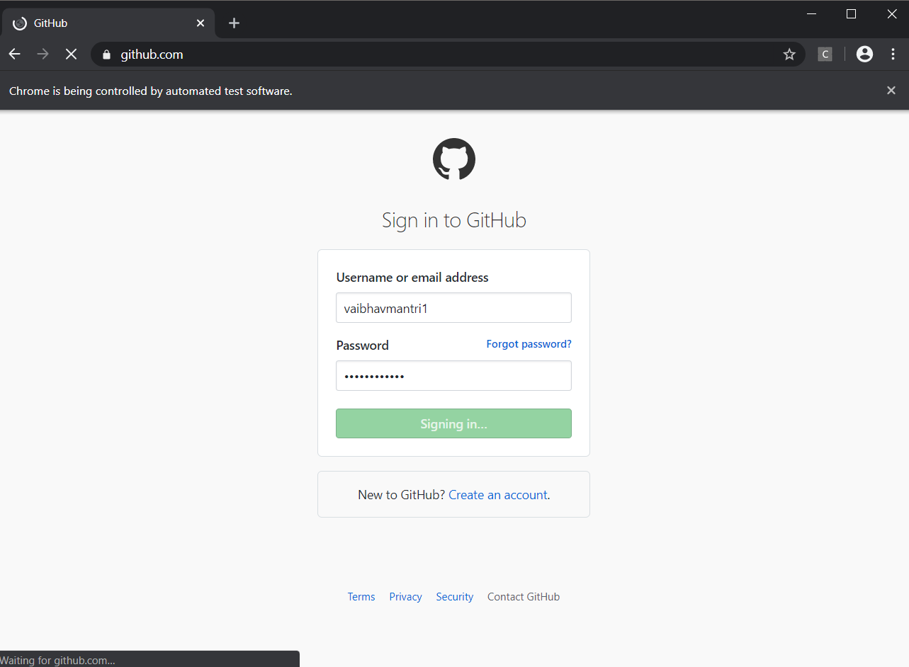

 # First-Automation-Python
 <h4>In this I've created an automation system for Github using Selenium where a user can enter their username or email and password.
 <h4>Then it asks for whether they want to create a new repository. If yes, User can type the desired name of the repository and thus    the repository is created.
 
 ## Requirements
 <b>Python :- </b>
 #### For Windows:- https://www.python.org/ftp/python/3.8.2/python-3.8.2.exe
 #### For Mac:- https://www.python.org/downloads/release/python-382/
 #### For Linux:- 
 ```
 sudo apt-get update
 sudo apt-get install python3.7
 ```
 ## Running
<h4>1. Run Command prompt as Administrator and run the following command.</h4>

<b>For Windows</b>
```
pip install selenium
```
<b>For Linux/Mac</b>
```
sudo pip install selenium
```
<h4>2. Clone the repository.</h4>

https://github.com/vaibhavmantri1/Github-Automation.git

<h4>3. Now run command prompt or powershell on the folder and run the following command.</h4>

<b>For Windows</b>
```
python application.py
```
<b>For Linux/Mac</b>
```
python3 application.py
```


